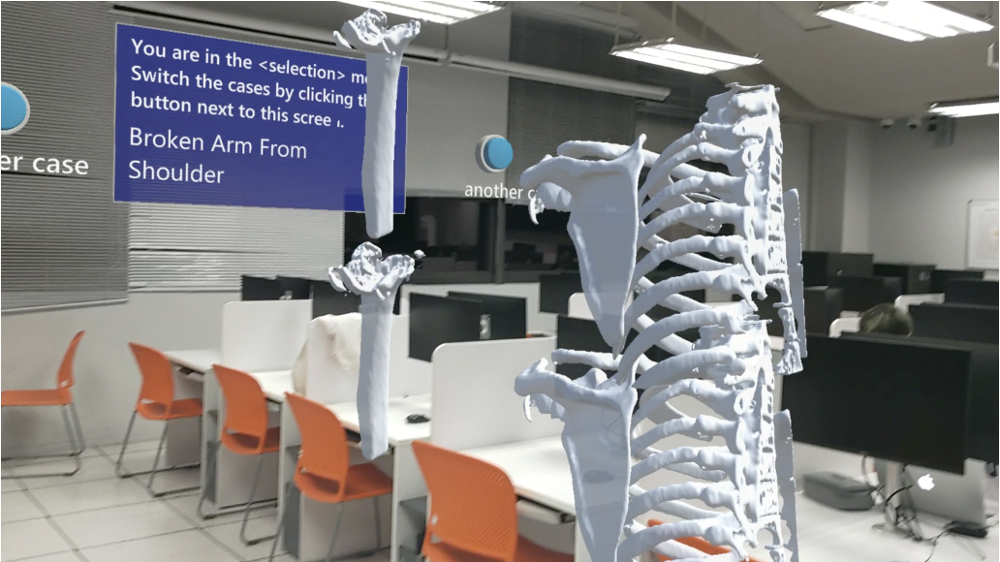
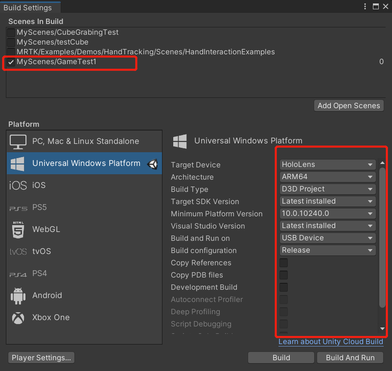
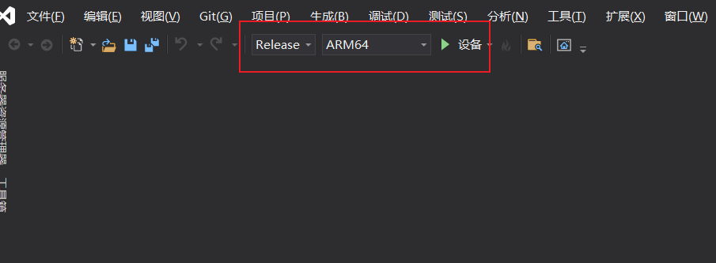
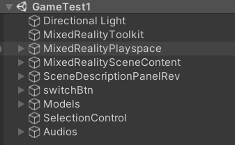
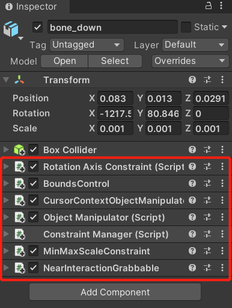

# MRTKtest
SUSTech 2022 多媒体课程project

前端：zal，zcz，leh；后段：zyq，zz

**（！！！非常重要）**
请注意，如果在克隆仓库时数据模型没有正确下载，在下方链接中获取压缩包并解压至Assets文件夹，具体位置可参考仓库内结构

[微云网盘](https://share.weiyun.com/lUumc4uU)：https://share.weiyun.com/lUumc4uU

## Introduction

这是一个基于MRTK Hololens的骨科手术AR模拟平台。基于Hololens，我们设计了如下功能：

+ 操作状态与选择状态
+ 操作状态：骨骼模型的移动，旋转，放大缩小
+ 选择状态：一个或多个谷歌模型的选中/取消选中
+ 选择状态：选中物体的复制，删除，绑定。解绑
+ 切换不同骨骼手术案例场景
+ 合成语音辅助解释交互
+ 高亮展示骨折/骨裂片段

+ Demo场景：
  + 断骨拼接
  + 骨裂修复
  + 健康骨骼与亚健康骨骼对比示意

## Configuration and Build

#### Hololens下载与环境配置

1. 下载windows10，VS以及相关包：https://docs.microsoft.com/en-us/windows/mixed-reality/develop/install-the-tools **这里Visual Studio 要下2019版！！**

2. 下载Unity 2020.3.x版本

3. 安装配置MRTK：https://docs.microsoft.com/en-us/windows/mixed-reality/develop/unity/welcome-to-mr-feature-tool

4. MRTK官方新手教程参考：https://docs.microsoft.com/en-us/learn/modules/learn-mrtk-tutorials

#### 生成并运行

1. 打开Unity进入项目，打开Asset>MyScene>GameTest1场景。
2. 点击File>Build and Settings, 配置好后，在新建文件夹里生成场景

3. 生成完成后进入文件夹，用VS打开.sln文件，在VS里调整这三项设置好：

3. PC和Hololens均配置为developer mode （参考：https://docs.microsoft.com/en-us/windows/mixed-reality/develop/advanced-concepts/using-visual-studio?tabs=hl2）后点击run。

4. PC第一次连接Hololens，运行之后会弹出配对（Pair对话框）：

## Front-end structure

#### Unity和MRTK相关学习资料

1. Unity C# 脚本入门级教程：https://www.youtube.com/watch?v=9tMvzrqBUP8
2. 教怎么设置button，并关联点击事件的视频：https://www.youtube.com/watch?v=kdkrjCF0KCo （里面涉及如何关联Scene的物体到脚本中变成实例的方法）
3. 非常nice的MRTK教程，有空可以看看：https://www.youtube.com/watch?v=-CPQf1V65ss

#### 前端框架

如上所示，我们的前端分为这几个部分：

+ MRTK自带模块(前三个)
  + Directional Light
  + MixedReality ToolKit
  + MixedRealityPlaySpace：AR相机
+ 前方大屏幕：SceneDescriptionPanelRev
+ 左方的键盘交互按钮：MixedRealitySceneContent
  + OperationPane: 选择模式下的panel，包含[复制粘贴，删除，绑定，退出]按钮
  + SelectionPane：操作模式下的panel，包含[选择，绑定]按钮
+ 切换控制：SwitchControl，负责切换场景
  + 包含大屏幕两边（切换场景的）按钮：switchBtn
+ 骨骼模型：Models，存放了4个场景的骨骼模型
+ 选择控制：SelectionControl，负责控制选择模式下的功能
+ 音频：Audio，存放指示音频

#### 放大缩小旋转功能实现

利用MRTK自带的API，我们可以在想要控制的模型上面添加如下script：

#### 按钮模型

来源于 Asset>MRTK>Examples>Demos>HandTracking>Scenes>HandInteractionExamples

#### 选中与绑定功能实现

在选择模式下，我们设计实现了复制、删除、绑定和解绑四种功能。这些功能都是对一个已选列表中的模型进行操作的。

##### 功能一：复制

复制功能主要是利用unity中GameObject类的Instantiate函数实现。为了避免模型重叠，我们设置复制后的物体将生成在原物体的上方。

##### 功能二：删除

删除功能使用GameObject类的SetActive函数对于场景中物体进行禁用，禁用后的物体将不可见。

##### 功能三：绑定

在Unity中，任意一个GameObject都会与其他的GameObject有父子关系。子物体的空间坐标、旋转信息等都是相对于父物体定义的。在这种情况下，若是我们移动或者旋转父物体，由于子物体相对于父物体的坐标不变，子物体会跟随父物体同时运动，从而达到绑定运动的效果。与此同时，子物体的运动又不会影响父物体，让我们在绑定之后依旧可以进行调整。因此，我们只需要在combine()方法中手动设置好物体之间的父子关系，就可以做到物体之间的绑定。

##### 功能四：解绑

与绑定操作同理，我们只需要在uncombine()方法中解除物体之间的父子关系既可解除绑定。

## Back-end structure

## Result Display

操作模式

选择模式

